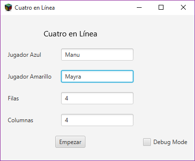
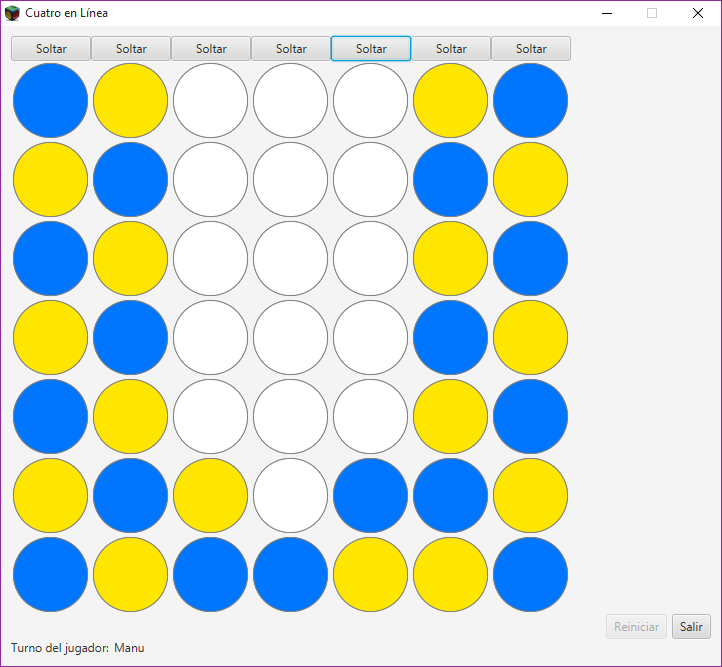

UNTreF - Algoritmos y Programación 1

# Trabajo Práctico: Cuatro en Lí­nea

## Problema

Completar el desarrollo de la aplicación Cuatro en Lí­nea.

## Enunciado

Implementar la clase CuatroEnLinea a partir de la siguiente especificación: 

[`CuatroEnLinea.java`](./src/juego/CuatroEnLinea.java).

[`Casillero.java`](./src/juego/Casillero.java)

### Pantallas

## Integrantes

* Mayra Aquino
* Emmanuel Vazquez

## Comision

* Lunes y Miercoles 18 - 22 hs.

## Profesores

* Facundo Rodriguez Arceri
* Santiago Risaro 
* Mariano Tugnarelli
* Lucas Ponce de León

